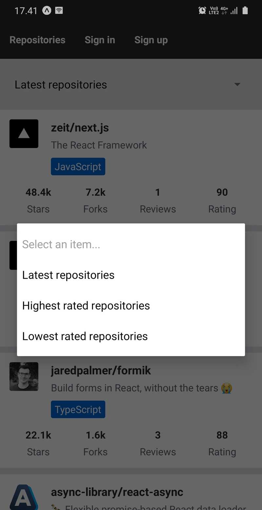
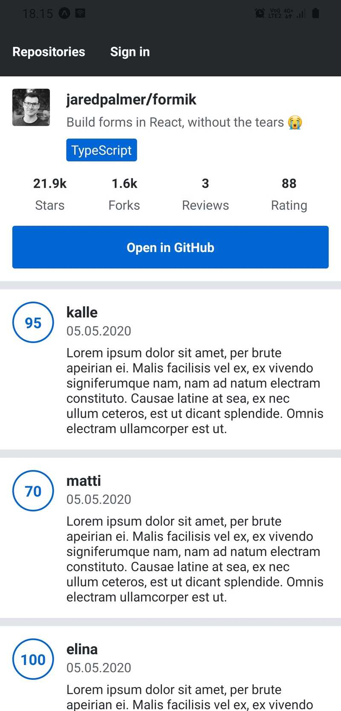
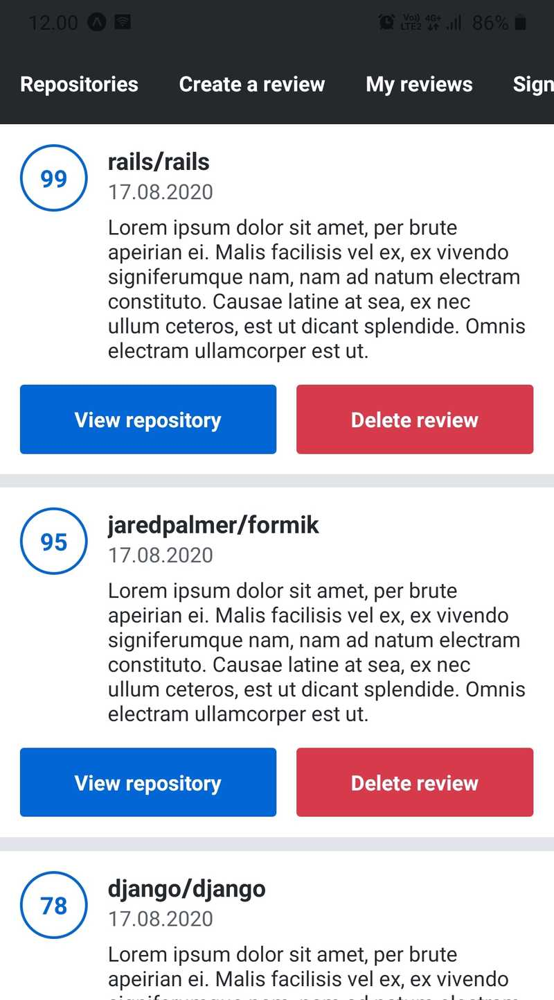
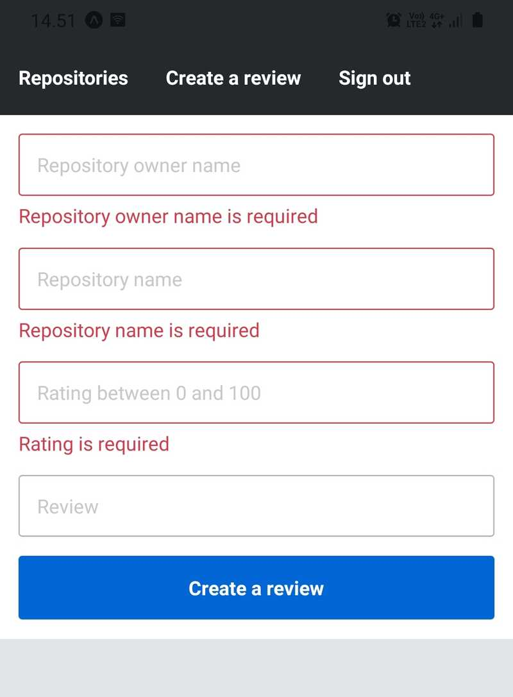

# GitHub Repositories Rating 
This is the a Github Repositories Rating mobile application build with React Native, Appolo (Graphql), Koa, sqlite and Knexjs QueryBuilder

## ✔️ Requirements

Node (versions `14.15.5` are tested, but later versions _might_ work as well) and npm. If you haven't installed Node or npm, [nvm](https://github.com/nvm-sh/nvm) is an easy to use tool for installing both. Npm is also handy if you want to quickly switch between different Node versions.

## 🚀 Supported Feature

### Repo Listing

### Repo Review

### Authentication

